# XGCS System Architecture

## Overview

XGCS is a modern, web-based ground control station built with a client-server architecture. The system enables real-time control and monitoring of UAVs through a browser-based interface.

---

## High-Level Architecture

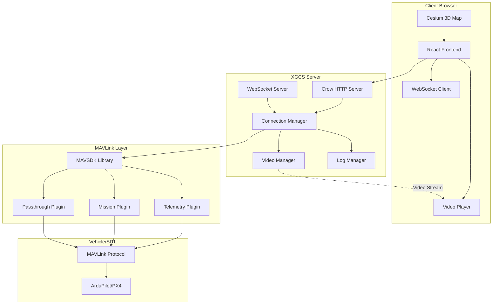

---

## Component Architecture

### 1. Frontend (React Application)

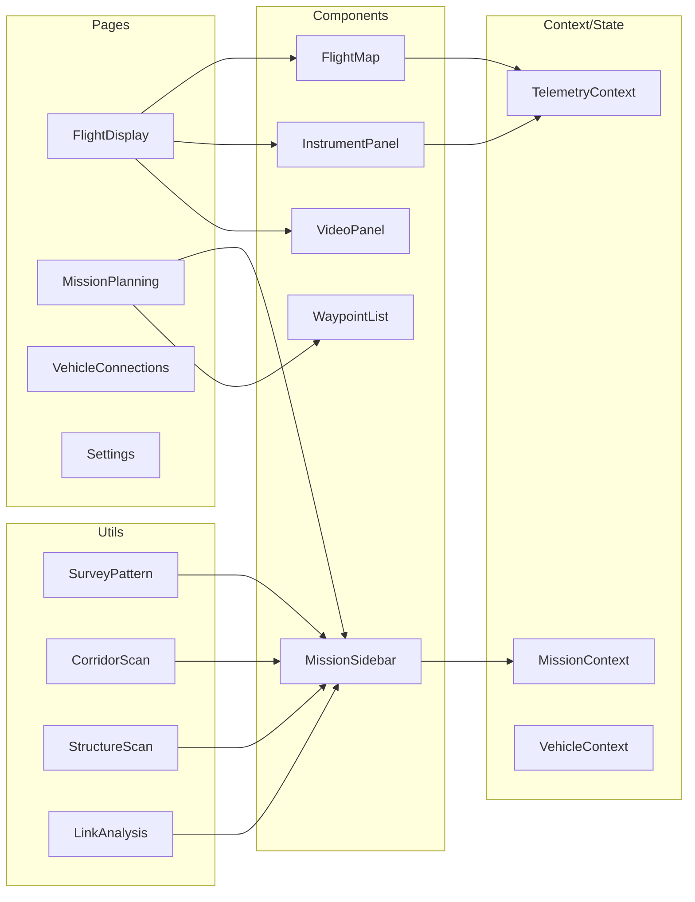

#### Key Frontend Components

**FlightDisplay.jsx**
- Main flight interface
- Integrates map, instruments, video, and controls
- Manages drawing modes and mission editing
- Handles vehicle selection

**FlightMap.jsx**
- Cesium-based 3D map rendering
- Vehicle position tracking
- Waypoint visualization
- Geofence and rally point display
- Drawing tools for mission planning

**InstrumentPanel.jsx**
- Real-time flight instruments
- Artificial horizon
- Compass rose
- Telemetry displays (altitude, speed, battery)
- Radio signal strength widget

**MissionSidebar.jsx**
- Mission planning controls
- Waypoint list management
- Survey/scan pattern generators
- Link budget analysis tool
- Geofence editor

---

### 2. Backend (C++ Server)

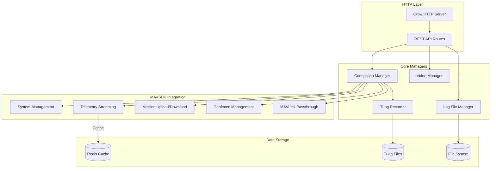

#### Key Backend Components

**ConnectionManager**
- Vehicle connection lifecycle management
- MAVSDK plugin initialization
- Telemetry data aggregation
- MAVLink message handling
- Radio status tracking and simulation

**VideoManager**
- GStreamer pipeline management
- UDP video reception
- WebRTC streaming to browser
- Multiple stream support

**LogFileManager**
- DataFlash log download from vehicle
- Log file organization
- Download progress tracking

**TLogRecorder**
- Real-time MAVLink message recording
- Session management
- TLog file generation

---

## Data Flow

### Telemetry Data Flow

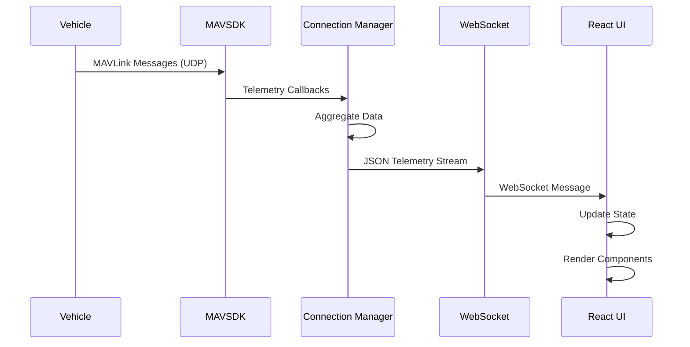

### Mission Upload Flow

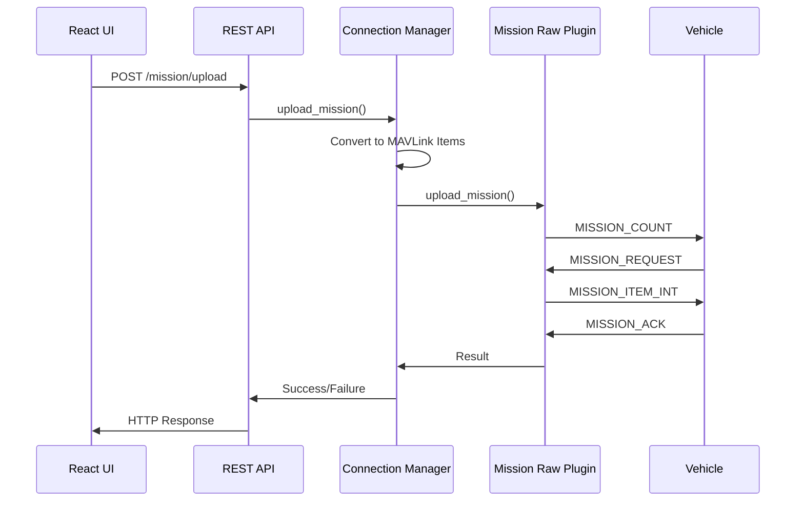

### Video Streaming Flow

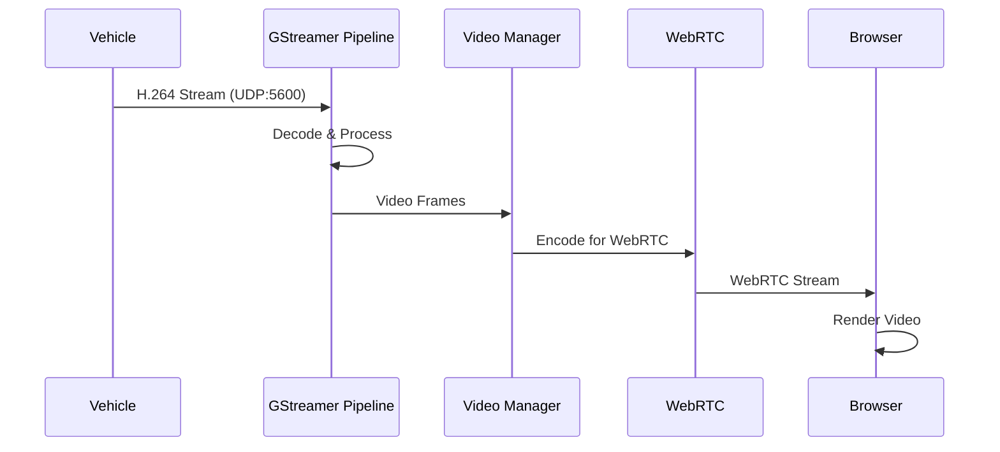

---

## Technology Stack

### Frontend Technologies

| Component | Technology | Purpose |
|-----------|-----------|---------|
| **Framework** | React 18 | UI framework |
| **UI Library** | Material-UI v5 | Component library |
| **3D Maps** | Cesium | Geospatial visualization |
| **State Management** | React Context | Global state |
| **HTTP Client** | Fetch API | REST API calls |
| **WebSocket** | Native WebSocket | Real-time data |
| **Build Tool** | Create React App | Development tooling |

### Backend Technologies

| Component | Technology | Purpose |
|-----------|-----------|---------|
| **Language** | C++17 | Core backend |
| **HTTP Server** | Crow | REST API server |
| **MAVLink** | MAVSDK | Vehicle communication |
| **Video** | GStreamer | Video processing |
| **JSON** | nlohmann/json | Data serialization |
| **Build System** | CMake | Build management |

---

## Communication Protocols

### REST API Endpoints

```
Vehicle Management:
  POST   /connect              - Connect to vehicle
  POST   /disconnect           - Disconnect from vehicle
  GET    /vehicles             - List connected vehicles
  GET    /telemetry            - Get telemetry snapshot
  GET    /telemetry/all        - Get all vehicles telemetry

Mission Management:
  POST   /mission/upload       - Upload mission to vehicle
  GET    /api/mission/download/:id - Download mission from vehicle
  POST   /mission/start        - Start mission execution
  POST   /mission/clear        - Clear mission

Flight Control:
  POST   /api/command/takeoff  - Takeoff command
  POST   /api/command/land     - Land command
  POST   /api/command/rtl      - Return to launch
  POST   /api/command/arm      - Arm motors
  POST   /api/command/disarm   - Disarm motors
  POST   /api/command/set_mode - Change flight mode

Geofencing:
  POST   /api/geofence/upload  - Upload geofence
  POST   /api/geofence/clear   - Clear geofence

Rally Points:
  POST   /api/rally/upload     - Upload rally points

Calibration:
  POST   /api/calibration/compass/start
  POST   /api/calibration/compass/cancel
  POST   /api/calibration/accelerometer/start
  GET    /api/calibration/:id/status

Logs:
  GET    /api/logs/list        - List available logs
  POST   /api/logs/download/:id - Download log file
  GET    /api/sessions         - List TLog sessions
  GET    /api/sessions/download/:id - Download TLog

Video:
  POST   /api/video/start      - Start video stream
  POST   /api/video/stop       - Stop video stream
  GET    /api/video/status     - Video stream status

Simulation:
  POST   /api/simulation/radio - Configure radio simulation
```

### WebSocket Protocol

**Connection**: `ws://localhost:8081/api/mavlink/stream/:vehicleId`

**Message Format**:
```json
{
  "msgName": "ATTITUDE",
  "msgId": 30,
  "timestamp": 1642534567890,
  "system_id": 1,
  "component_id": 1,
  "fields": {
    "roll": 0.05,
    "pitch": -0.02,
    "yaw": 1.57
  }
}
```

---

## Deployment Architecture

### Development Environment

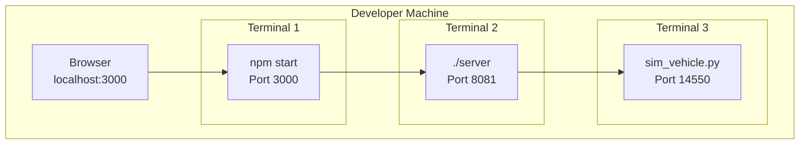

### Docker Deployment

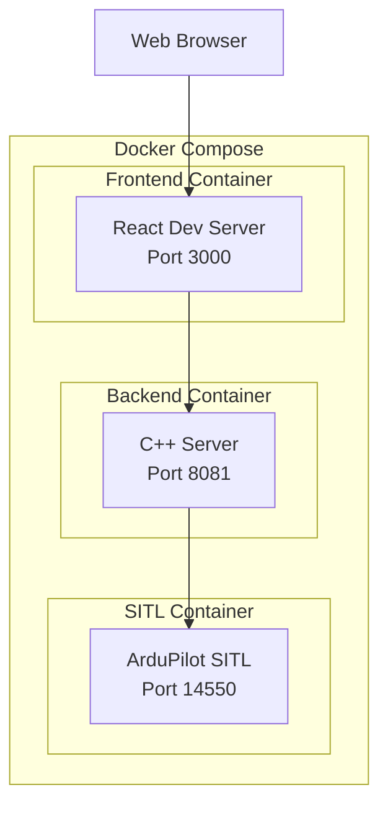

### Production Deployment

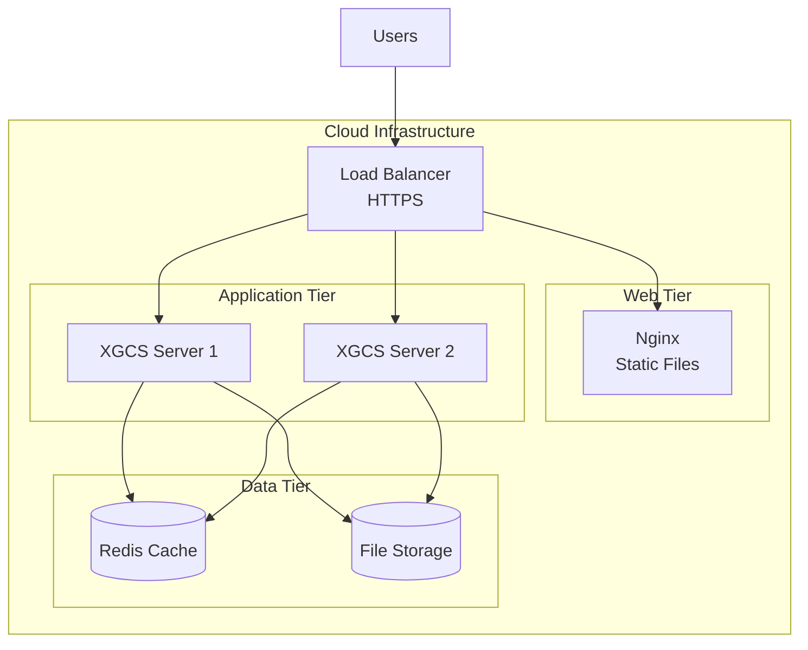

---

## Security Architecture

### Authentication Flow

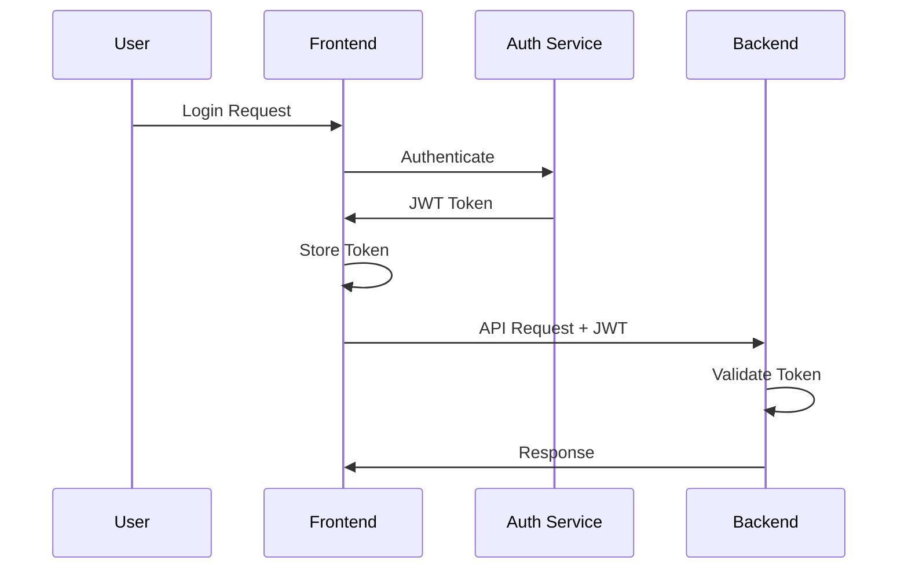

### Security Layers

1. **Transport Security**
   - HTTPS/WSS for all communications
   - TLS 1.3 encryption

2. **Authentication**
   - JWT token-based authentication
   - Session management
   - Token refresh mechanism

3. **Authorization**
   - Role-based access control (RBAC)
   - Vehicle-level permissions
   - Operation-level permissions

4. **Input Validation**
   - Server-side validation
   - SQL injection prevention
   - XSS protection

---

## Scalability Considerations

### Horizontal Scaling

- **Stateless Backend**: Each server instance is independent
- **Load Balancing**: Distribute requests across multiple servers
- **Session Affinity**: WebSocket connections sticky to server instance

### Vertical Scaling

- **Multi-threading**: Parallel telemetry processing
- **Connection Pooling**: Efficient resource utilization
- **Caching**: Redis for frequently accessed data

### Performance Targets

| Metric | Target |
|--------|--------|
| Telemetry Latency | < 100ms |
| API Response Time | < 50ms |
| WebSocket Throughput | 1000+ msg/sec |
| Concurrent Vehicles | 100+ per server |
| Concurrent Users | 1000+ per server |

---

## Data Models

### Telemetry Data Structure

```json
{
  "vehicle_id": "1",
  "timestamp": 1642534567890,
  "position": {
    "latitude": 37.7749,
    "longitude": -122.4194,
    "altitude_msl": 150.5,
    "altitude_rel": 50.0
  },
  "attitude": {
    "roll": 0.05,
    "pitch": -0.02,
    "yaw": 1.57
  },
  "velocity": {
    "north": 5.2,
    "east": -1.3,
    "down": -0.5
  },
  "battery": {
    "voltage": 12.6,
    "current": 15.3,
    "remaining": 75
  },
  "gps": {
    "fix_type": 3,
    "satellites": 12
  },
  "flight_mode": "AUTO",
  "armed": true,
  "radio": {
    "rssi": -65,
    "remrssi": -68,
    "noise": -95,
    "snr": 30
  }
}
```

### Mission Item Structure

```json
{
  "seq": 0,
  "frame": 3,
  "command": 16,
  "current": 0,
  "autocontinue": 1,
  "param1": 0,
  "param2": 0,
  "param3": 0,
  "param4": 0,
  "x": 37.7749,
  "y": -122.4194,
  "z": 50.0,
  "mission_type": 0
}
```

---

## Error Handling

### Error Propagation

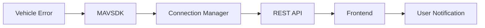

### Error Categories

1. **Connection Errors**
   - Vehicle unreachable
   - Network timeout
   - Protocol mismatch

2. **Command Errors**
   - Command rejected
   - Invalid parameters
   - Vehicle not ready

3. **Mission Errors**
   - Upload failed
   - Invalid waypoints
   - Mission too large

4. **System Errors**
   - Out of memory
   - Disk full
   - Service unavailable

---

## Monitoring & Logging

### Logging Architecture

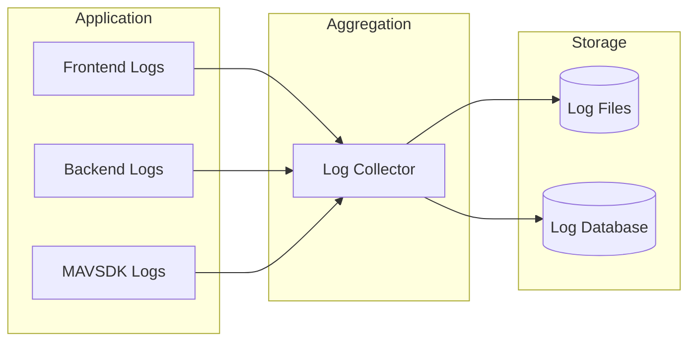

### Metrics Collection

- **Telemetry Metrics**: Message rate, latency
- **API Metrics**: Request count, response time
- **System Metrics**: CPU, memory, disk usage
- **Business Metrics**: Active vehicles, missions executed

---

## Future Architecture Enhancements

### Planned Improvements

1. **Microservices Architecture**
   - Separate services for telemetry, mission, video
   - Independent scaling
   - Service mesh integration

2. **Event-Driven Architecture**
   - Message queue (RabbitMQ/Kafka)
   - Asynchronous processing
   - Event sourcing

3. **Cloud-Native Features**
   - Kubernetes deployment
   - Auto-scaling
   - Service discovery
   - Health checks

4. **Advanced Analytics**
   - Real-time analytics pipeline
   - Machine learning integration
   - Predictive maintenance

---

## Conclusion

XGCS is built on a modern, scalable architecture that separates concerns between presentation (React), business logic (C++ backend), and vehicle communication (MAVSDK). This design enables:

- **Flexibility**: Easy to add new features
- **Scalability**: Support for multiple vehicles and users
- **Maintainability**: Clear separation of concerns
- **Performance**: Optimized for real-time operations
- **Reliability**: Robust error handling and recovery